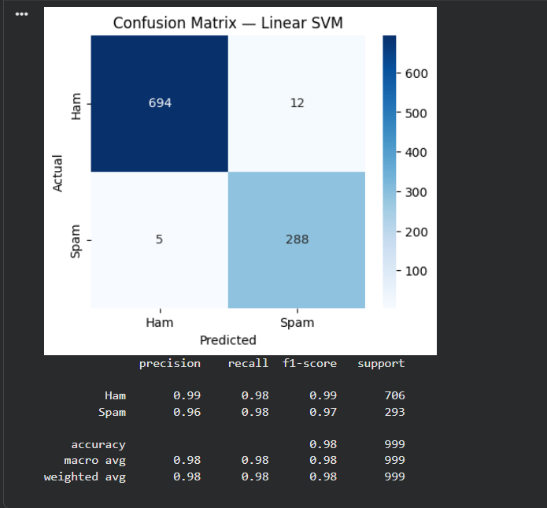

# Email Spam Classification

A machine learning model that classifies emails as spam or legitimate (ham), built using classical NLP techniques and a comparison of multiple classifiers.

## Overview

This project takes raw, labelled email text and builds an end-to-end pipeline to detect spam — from text cleaning through to a trained, evaluated model. Built as part of a Machine Learning internship task.

## Dataset

- **Source:** [Spam Mails Dataset (Kaggle)](https://www.kaggle.com/datasets/venky73/spam-mails-dataset)
- **Size:** 5,171 labelled emails (71% ham, 29% spam)
- After removing 178 duplicate rows: 4,993 emails used for training/testing

## Approach

1. **Text preprocessing** — stripped "Subject:" headers, lowercased text, removed punctuation/numbers, removed stopwords, applied lemmatization
2. **Feature extraction** — TF-IDF vectorization (top 5,000 features, unigrams + bigrams)
3. **Model comparison** — trained and evaluated Naive Bayes, Logistic Regression, and Linear SVM
4. **Evaluation** — accuracy, precision, recall, F1-score, and confusion matrix on a held-out test set

## Results

| Model | Accuracy | Precision | Recall | F1 Score |
|---|---|---|---|---|
| Naive Bayes | 94.8% | 86.6% | 97.3% | 0.916 |
| Logistic Regression | 97.3% | 93.8% | 97.3% | 0.955 |
| **Linear SVM (best)** | **98.3%** | **96.0%** | **98.3%** | **0.971** |

The final Linear SVM model correctly classified 982 of 999 test emails, with only 12 false positives and 5 false negatives.

## Tech Stack

- Python
- pandas, NumPy
- scikit-learn
- NLTK
- matplotlib, seaborn

## How to Run

1. Open `email_spam_classification.ipynb` in Google Colab or Jupyter
2. Install dependencies: `pip install kagglehub scikit-learn nltk pandas matplotlib seaborn`
3. Run all cells in order — the notebook downloads the dataset automatically via `kagglehub`

## Sample Output

